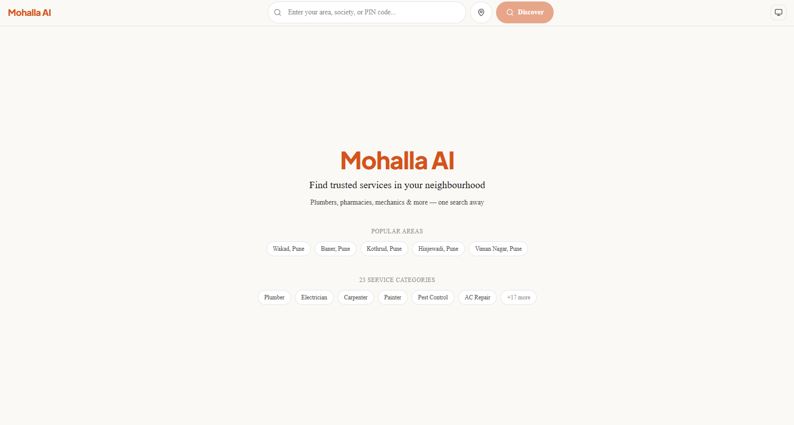
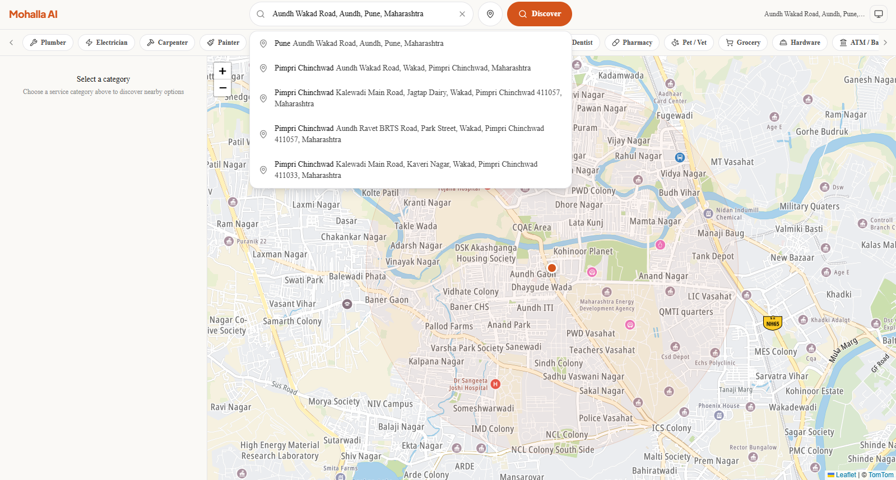
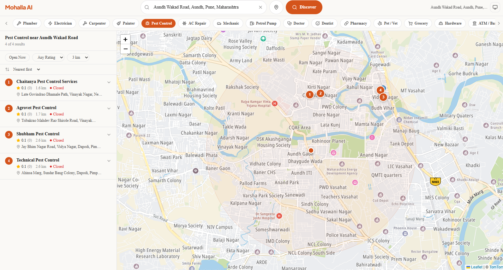
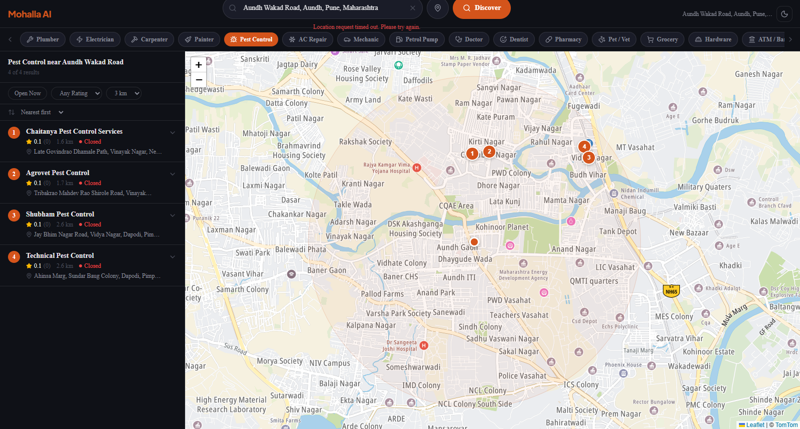

<div align="center">

# Mohalla AI

**Neighbourhood Service Discovery Platform for Indian Cities**

*Find plumbers, pharmacies, dentists, mechanics & 23 service categories near you — one search away.*

[](https://nextjs.org)
[](https://www.typescriptlang.org)
[](https://react.dev)
[](https://tailwindcss.com)
[](src/__tests__/)
[](LICENSE)

[**Documentation →**](docs/)&nbsp;&nbsp;|&nbsp;&nbsp;[**Project Plan →**](IMPLEMENTATION_PLAN.md)

</div>

---

## Overview

Mohalla AI is a web-based neighbourhood service discovery platform that enables residents of Indian cities to instantly find trusted local services — plumbers, electricians, pharmacies, dentists, mechanics, and more — simply by entering their area, society, or locality name. The platform delivers real-time, location-aware results with phone numbers, addresses, distance, and open/closed status on an interactive map.

The platform addresses a genuine gap in the Indian urban experience: when you move to a new neighbourhood, finding reliable local services requires fragmented searches across Google Maps, JustDial, word-of-mouth, and society WhatsApp groups. Mohalla AI consolidates this into a single, elegant interface with a map-centric design.

**What makes this different from typical service discovery tools:**
- **Hyperlocal focus** — Searches are scoped to your specific neighbourhood, not the entire city. Results are sorted by walking distance.
- **Auto-expanding radius** — Never shows "no results". Automatically widens the search up to 50 km to find the nearest facility.
- **23 India-specific categories** — Includes categories like Tailor, Pest Control, Tuition, Hardware Store, and AC Repair that generic platforms miss.
- **Zero cost, zero billing** — Runs entirely on TomTom's free tier (2,500 requests/day, no credit card required) with OSM map tiles.
- **Real-time data** — Phone numbers, addresses, and open/closed status from TomTom's verified POI database — not scraped or crowdsourced.

---

## Architecture

```
User types area name (e.g. "Wakad, Pune")
    |
    v
+-------------------------------+
|  SearchBar Component          |  Debounced autocomplete (300ms)
|  - Autocomplete dropdown      |  Keyboard nav, GPS button, recent searches
+---------------+---------------+
                |
                v
+-------------------------------+
|  /api/geocode                 |  TomTom Geocoding API
|  - Area name -> lat/lng       |  Cached 30 days (in-memory / Redis)
+---------------+---------------+
                |
                v
+-------------------------------+
|  CategoryPills (23 categories)|  User selects: Plumber, Pharmacy, etc.
+---------------+---------------+
                |
                v
+-------------------------------+
|  /api/discover                |  TomTom POI Search API
|  - lat/lng + category -> POIs |  Auto-expands: 3km -> 5km -> 10km -> 25km -> 50km
|  - Cached 24 hours            |  Returns: name, phone, address, distance, hours
+---------------+---------------+
                |
        +-------+-------+
        |               |
        v               v
+---------------+ +------------------+
|  Sidebar      | |  Leaflet Map     |
|  - ResultCards| |  - Numbered pins |
|  - Filters    | |  - Radius circle |
|  - Sort/Detail| |  - Click sync    |
+---------------+ +------------------+
        |               |
        +-------+-------+
                |
                v
        Bidirectional sync
        (hover card = highlight pin)
```

---

## Features

| Feature | Detail |
|---------|--------|
| **One-search discovery** | Type your area name, get categorized service results in under 2 seconds |
| **23 service categories** | Plumber, Electrician, Carpenter, Painter, Pest Control, AC Repair, Mechanic, Doctor, Dentist, Pharmacy, Pet/Vet, Grocery, Hardware, ATM/Bank, Salon, Gym, Laundry, Restaurant, Computer/Phone, Tuition, Courier, Tailor, Petrol Pump |
| **Interactive map** | Leaflet + OpenStreetMap with numbered markers synced to sidebar cards |
| **Smart autocomplete** | TomTom Fuzzy Search with debounced suggestions as you type |
| **GPS detection** | "Use my current location" button with permission handling |
| **Auto-expanding radius** | Widens search from 3 km up to 50 km to always find results |
| **Filters & sorting** | Open Now toggle, minimum rating, radius slider, sort by distance/rating/reviews |
| **Card-map sync** | Hover a card to highlight its pin, click a pin to scroll to its card |
| **Dark mode** | Full dark/light/system theme toggle with persistence |
| **Mobile responsive** | Bottom sheet pattern on mobile, split-panel on desktop |
| **PWA ready** | Manifest, service worker config, installable to homescreen |
| **SEO optimized** | Dynamic sitemap (60+ URLs), robots.txt, OpenGraph metadata |
| **Cached API calls** | In-memory cache with TTL (Redis-ready) to minimize API usage |
| **88 unit tests + 12 E2E** | Comprehensive test coverage with Vitest and Playwright |

---

## Tech Stack

| Layer | Technology | Purpose |
|-------|-----------|---------|
| **Framework** | Next.js 16 (App Router, Turbopack) | SSR, API routes, file-based routing |
| **Language** | TypeScript 5 (strict, noUncheckedIndexedAccess) | End-to-end type safety |
| **UI Library** | React 19 | Component-based user interface |
| **Styling** | Tailwind CSS v4 + shadcn/ui | Utility-first CSS with accessible components |
| **Maps** | Leaflet + OpenStreetMap tiles | Free interactive map display |
| **Geocoding & Search** | TomTom Search API | Geocoding, autocomplete, POI nearby search |
| **State Management** | Zustand | Lightweight global store for search, discovery, filters |
| **Validation** | Zod v4 | Runtime schema validation for all API inputs |
| **Unit Testing** | Vitest + Testing Library | 88 unit and integration tests |
| **E2E Testing** | Playwright | 12 end-to-end browser tests |
| **ORM** | Prisma v7 | PostgreSQL schema for analytics and caching |
| **Cache** | In-memory (Redis-ready) | TTL-based caching for API responses |
| **CI/CD** | GitHub Actions + Vercel | Automated lint, test, build, deploy pipeline |
| **Package Manager** | pnpm | Fast, disk-efficient dependency management |

---

## Project Structure

```
src/
├── app/
│   ├── api/
│   │   ├── geocode/          # POST — area name to coordinates
│   │   ├── autocomplete/     # POST — search suggestions
│   │   ├── discover/         # POST — nearby service search
│   │   ├── details/[id]/     # GET  — full place details
│   │   ├── categories/       # GET  — list 23 categories
│   │   └── health/           # GET  — health check
│   ├── layout.tsx            # Root layout (fonts, theme, PWA meta)
│   ├── page.tsx              # Landing + discover page
│   ├── sitemap.ts            # Dynamic sitemap (60+ URLs)
│   └── robots.ts             # Crawler rules
├── components/
│   ├── search/               # SearchBar with autocomplete
│   ├── map/                  # MapContainer (Leaflet), MapWrapper (SSR-safe)
│   ├── sidebar/              # Sidebar, ResultCard, CardDetail, EmptyState
│   ├── category/             # CategoryPills (23 categories with icons)
│   ├── filters/              # FilterPanel, SortDropdown
│   ├── layout/               # TopBar, DiscoverLayout, MobileBottomSheet, ThemeToggle
│   └── ui/                   # shadcn/ui primitives (button, card, skeleton, etc.)
├── lib/
│   ├── tomtom/               # TomTom API clients (geocode, autocomplete, places)
│   ├── cache/                # In-memory / Redis cache layer
│   ├── db/                   # Prisma client singleton + analytics logger
│   ├── validators/           # Zod schemas for API request validation
│   ├── constants/            # 23 categories config, app config, design tokens
│   └── utils/                # Haversine distance, slugify, client-side filters
├── hooks/                    # useDebounce, useGeolocation, useMapSync
├── store/                    # Zustand store (search, discovery, map, filters)
├── types/                    # TypeScript interfaces for all data models
└── __tests__/                # 88 unit/integration + 12 E2E tests
```

---

## Quick Start

### Prerequisites
- Node.js 20+ ([download](https://nodejs.org))
- pnpm 8+ (`npm install -g pnpm`)
- TomTom API key — [free signup](https://developer.tomtom.com) (no credit card needed)

### 1. Clone and install

```bash
git clone https://github.com/ninjacode911/Project-Mohalli-AI.git
cd Project-Mohalli-AI
pnpm install
```

### 2. Configure secrets

```bash
cp .env.example .env.local
```

Edit `.env.local` and add your TomTom API key:

```
TOMTOM_API_KEY=your_key_here
NEXT_PUBLIC_TOMTOM_API_KEY=your_key_here
```

### 3. Run

```bash
pnpm dev
```

### 4. Use it
1. Open [http://localhost:3000](http://localhost:3000) in your browser
2. Type an area name (e.g. "Wakad, Pune") in the search bar
3. Select a suggestion from the autocomplete dropdown
4. Click a service category (Plumber, Pharmacy, Dentist, etc.)
5. Browse results in the sidebar — click cards to expand, tap "Call Now" to dial

---

## Running Tests

```bash
# Unit and integration tests (88 tests)
pnpm test

# E2E browser tests (12 tests — requires Playwright)
pnpm exec playwright install chromium
pnpm test:e2e

# Type check
pnpm typecheck

# Lint
pnpm lint
```

---

## Configuration

| Variable | Default | Description |
|----------|---------|-------------|
| `TOMTOM_API_KEY` | — | Server-side TomTom API key (required) |
| `NEXT_PUBLIC_TOMTOM_API_KEY` | — | Client-side key for map tiles (required) |
| `REDIS_URL` | — | Redis connection URL (optional, uses in-memory fallback) |
| `DATABASE_URL` | — | PostgreSQL URL (optional, analytics disabled without it) |
| `NEXT_PUBLIC_APP_URL` | `http://localhost:3000` | Application base URL |
| `SENTRY_DSN` | — | Sentry error tracking DSN (optional) |

---

## Security

| Control | Implementation |
|---------|---------------|
| **API key isolation** | TomTom keys server-side only; client key restricted to map tiles |
| **Input validation** | Zod schemas validate every API request at the boundary |
| **No PII stored** | No user data stored server-side beyond anonymous search analytics |
| **HTTPS enforced** | Strict-Transport-Security header via Vercel config |
| **Security headers** | X-Content-Type-Options, X-Frame-Options, X-XSS-Protection, Referrer-Policy, Permissions-Policy |
| **Dependency audit** | `pnpm audit` returns zero vulnerabilities |
| **Git hygiene** | `.env.local` gitignored, no secrets in any committed file |

---

## Screenshots

### Landing Page — Search & Popular Areas


### Autocomplete — Live Search Suggestions with Map


### Results View — Split Panel with Numbered Markers (Light Mode)


### Results View — Dark Mode


---

## License

**Source Available — All Rights Reserved.** See [LICENSE](LICENSE) for full terms.

The source code is publicly visible for viewing and educational purposes. Any
use in personal, commercial, or academic projects requires explicit written
permission from the author.

To request permission: navnitamrutharaj1234@gmail.com

**Author:** Navnit Amrutharaj
